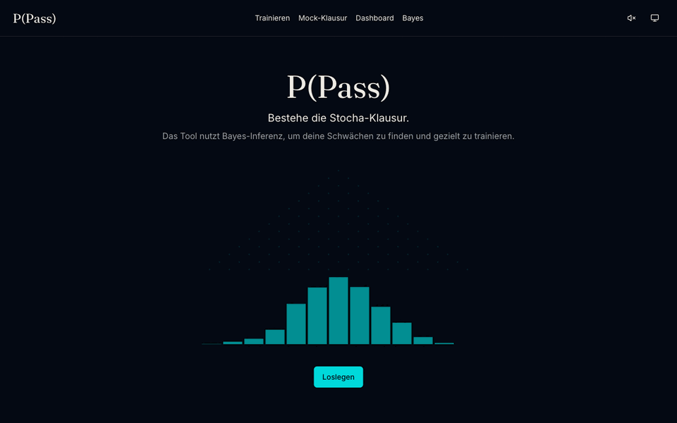

# P(Pass) — Adaptiver Stochastik-Klausur-Coach

> Bestehe die Stocha-Klausur. P(Pass) nutzt **Bayes-Inferenz**, um deine Schwächen zu finden und dich gezielt zu trainieren — und legt dieselbe Bayes-Rechnung im Inspector transparent offen. **Du lernst Stocha mit einem Tool, das selbst Stocha ist.**

**🔗 Live-Demo:** [medformatik.github.io/p-pass](https://medformatik.github.io/p-pass/) · **📚 Hackathon-Submission:** RWTH StochaHackathon 2026



## Was kann P(Pass)?

- 🎯 **250 handkuratierte Aufgaben** im Klausur-Stil über alle drei Klausurblöcke (Deskriptive Statistik · Wahrscheinlichkeitsrechnung · Schließende Statistik)
- 🧠 **Adaptive Auswahl** per Bayesian Knowledge Tracing (BKT): das System schätzt pro Skill, wie sicher du es kannst (P(L) ∈ \[0, 1\]), und stellt dir die Aufgaben, die am meisten Nutzen bringen
- 📊 **13 interaktive Visualisierungen**: Galton-Brett, Binomial-PMF, Bayes-Updater, **Wahrscheinlichkeitsbaum**, Konfidenzintervall-Simulator, Hypothesentest, Poisson-Prozess, Lorenz/Gini, Boxplot, Regression, CLT-Demo, Random-Walk, Markov-Kette
- 📝 **Mehrteilige Mock-Klausuraufgaben** (7 Aufgaben mit je 4 Teilen) — echtes Klausur-Format mit (a), (b), (c), (d)
- 🔍 **Bayes-Inspektor**: Sieh Schritt für Schritt, wie der Algorithmus deine P(L) updated — mit derselben Mathematik, die du gerade lernst
- 🧪 **Eingangstest** (5 Fragen ohne Feedback) bootstrappt die Skill-Wahrscheinlichkeiten — kein Cold-Start mit 0 %
- 🏃 **Mock-Klausur**-Modus mit Stopwatch und Auswertung am Ende
- 📤 Fortschritt im **localStorage**, Export/Import als JSON für Gerätewechsel
- ⌨️ Vollständig auf der **Tastatur** bedienbar (`a–e` für MC, `Enter` zum Prüfen, `→` für die nächste)
- 🌗 **Theming** (System / Hell / Dunkel)
- 📱 **Responsive Mobile-UX** mit Bottom-Navigation

## Erste Schritte (für Nutzer:innen)

1. **Eingangstest** klicken — 5 schnelle Fragen kalibrieren deine Anfangs-Schätzwerte
2. **Trainieren** — das Tool sucht automatisch deine schwächste Stelle und gibt dir eine passende Aufgabe
3. Nach ~30 Aufgaben: **Mock-Klausur** für eine realistische Probe-Klausur unter Zeit
4. Schwächen sichtbar im **Dashboard** (Heatmap), Lerntechnik dahinter im **Bayes-Inspector**

## Wie funktioniert die Adaption?

Pro Skill hält das System eine Wahrscheinlichkeit P(L) („du beherrschst diesen Skill") im Kopf. Nach jeder Antwort wird P(L) per **Bayes-Posterior** geupdated:

- **Richtig** → P(L) steigt (aber nicht auf 1, wegen Guess-Wahrscheinlichkeit P(G))
- **Falsch** → P(L) fällt (aber nicht auf 0, wegen Slip-Wahrscheinlichkeit P(S))
- Plus „Learn-Transition": auch ohne Antwort steigt P(L) leicht über Zeit (P(T))

Die nächste Aufgabe wird per **gewichteter Auswahl** vorgeschlagen: Skills mit niedrigem P(L) bekommen mehr Gewicht (Schwächentraining), Recency-Penalty verhindert Wiederholungen.

Die Mathematik ist die gleiche, die in den Lehrbüchern von Cramer/Kamps und Steland steht — gerade darum ist es nicht nur ein Lerntool, sondern auch ein **lebendes Beispiel** des Vorlesungsstoffs.

## Lokal entwickeln

```bash
git clone https://github.com/Medformatik/p-pass
cd p-pass
npm install
npm run dev        # http://localhost:5173
npm run test:run   # Vitest
npm run build      # Production-Build → dist/
```

## Tech-Stack

React 19 · TypeScript 6 · Vite 8 · Tailwind 4 · shadcn/ui · motion 12 · D3 7 · Zustand 5 · KaTeX · Vitest 4 · Lucide-Icons

Statisches Build (kein Backend, keine Auth, keine Tracking-Cookies). Hostbar auf GitHub Pages / Cloudflare Pages / jedem statischen Hoster. Auto-deploy zu GitHub Pages bei Push auf `main` via `.github/workflows/deploy.yml`.

## Lizenz & Credits

Code unter [MIT](LICENSE). Aufgabentexte sind eigene Formulierungen, angelehnt an:

- Cramer, E. & Kamps, U. — „Klausurtraining Statistik" sowie „Grundlagen der Wahrscheinlichkeitsrechnung und Statistik" (RWTH Aachen)
- Steland, A. — „Basiswissen Statistik" (RWTH Aachen)

Entwickelt im Rahmen des **StochaHackathons 2026** an der RWTH Aachen.
